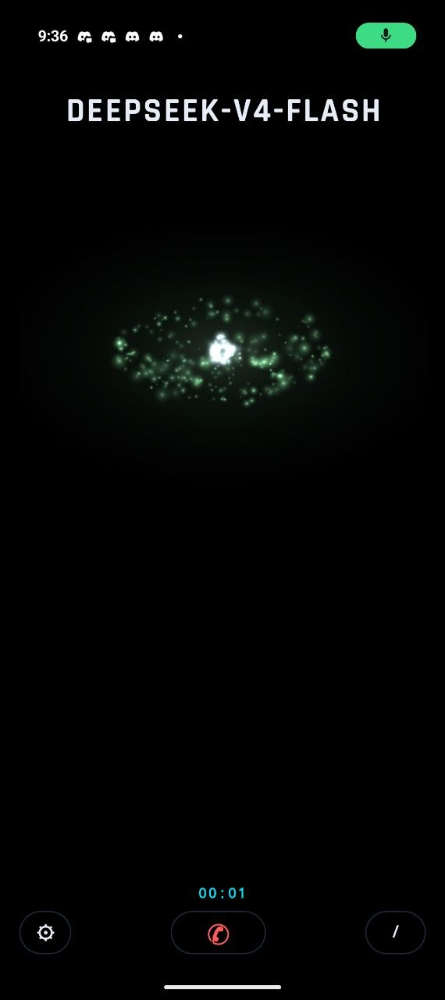
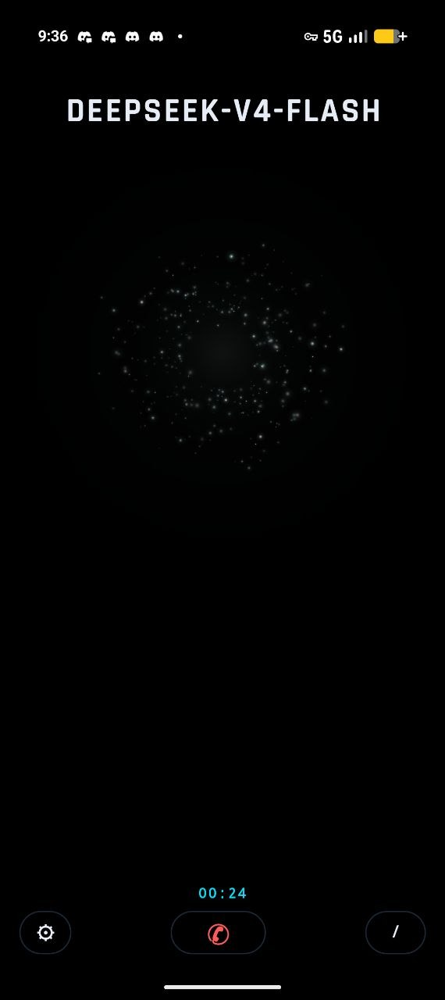
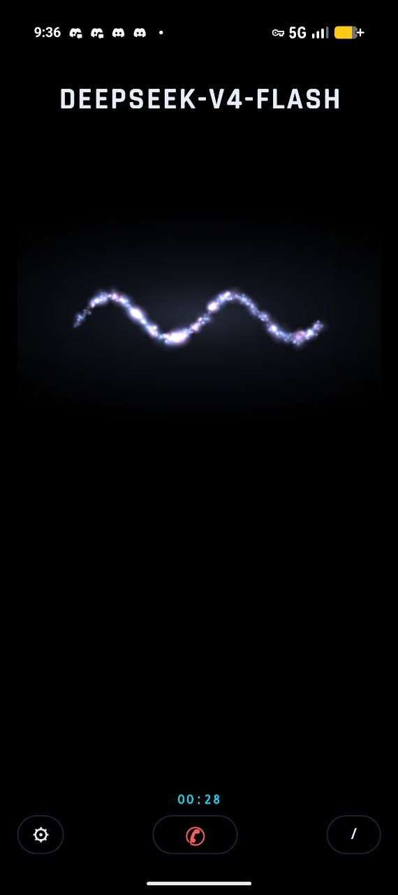
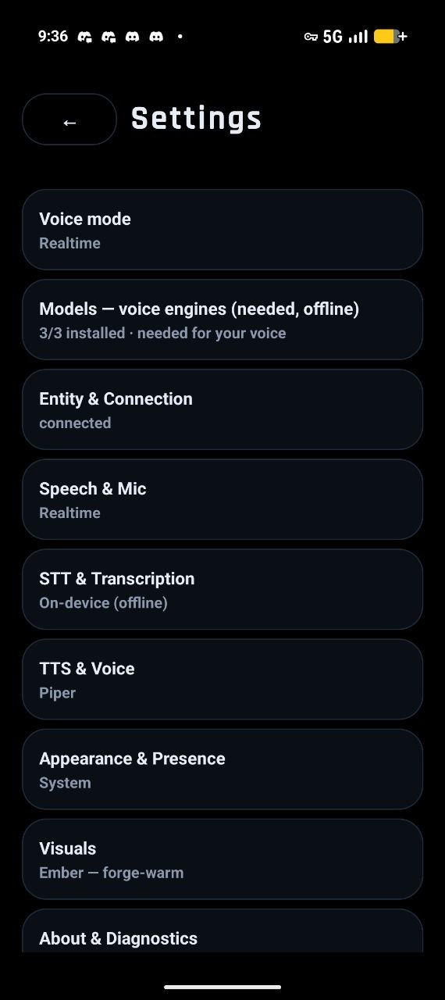

# Hermes Vox

**The voice of Hermes — on your phone.** A native Android voice client that feels
like talking to a living AI presence (the Sesame Miles/Maya experience) but **is**
the Hermes agent: the same identity, the same mind, the same abilities — you
talk to the same entity you use everywhere else.

> **Beta — early days, rapid development.** Hermes Vox is a working, installable
> MVP and it's moving fast — expect rough edges and things that shift between
> releases. We'd love help, especially **testing, polishing, and bug-finding**.
> Found something? Open an issue.

> **Bring your own gateway.** Hermes Vox is a **client**, not a service. There is
> no Hermes-hosted cloud and nothing to sign up for: you point the app at **your
> own Hermes gateway** — the endpoint and API key of a Hermes instance *you* run,
> whether local, self-hosted on your own network, or on a remote box you own. The
> app never ships with a gateway, and the maintainers don't host one for you.

---

## See it

The presence-first design language, live on the emulator:









---

## What it is

A thin Android client that gives Hermes a face and a voice. **The entity IS
Hermes** — not a separate persona layered on top. Hermes owns the reasoning,
tooling, memory, and context; the phone is the "front of house": it captures your
voice, renders Hermes's work as a living presence, and speaks Hermes's answer.

Local-first and sovereign: **on-device** speech processing (Whisper STT, Silero
VAD, Piper TTS) — no cloud, no third-party SDKs, no keys in the repo. The entity
endpoint + API key are user-entered in-app; the gateway behind them is yours.

## The two voice modes

Mode-selectable in Settings → **Voice mode**:

1. **Realtime** — hands-free: on-device STT/VAD/TTS + Hermes, an open
   hands-free line (VAD-gated, barge-in). Feels like a live call.
2. **Enhanced Realtime (alpha)** — Realtime **+** the on-device **Gemma 4 E2B**
   expression layer (the phone-call persona). Experimental — the presence layer
   is not yet wired into the immersive view.

**The entity stays Hermes in both modes.** Only the foreground voice/persona
changes. Every mode is hands-free — there is no push-to-talk button.

## The design language — "the House is a presence, not a machine"

Everything orbits a single idea: a living being that *does* the work, and the
voice as its words, over true OLED black.

- **The being** — a generative particle-being (hundreds of points of light) that
  is Hermes's presence. It breathes at rest (a teal eye/wisp), gathers + warms
  when working, sparkles when speaking, and reacts to the agent's **real** tool
  calls (terminal → bracket, web → scan, file → fold, memory → constellation)
  with a workload ramp. Its shape language is a **20-archetype** vocabulary —
  from a quiet orb to a bloom — and shapes are generative (parametric, re-seeded
  each call), so no two states look identical.
- **The voice** — the reply as a **Star-Wars crawl** over the black, synced with
  speech, fading before it touches the particles. The SSE/dev log renders the
  same but smaller + darker (a distinct tier, hidden by default).
- **The icon** — the same identity distilled to launcher size: a lone glowing eye
  on pure OLED black.
- **No chrome** — no pills/boxes; just the being + the words.
- **Type** — Rajdhani (sci-fi geometric, OFL) for the display chrome; monospace
  for the voice. Two voices, clearly different.
- **Motion** — staged entrance, breathing, spring physics, re-seeded shapes.

Onboarding carries the same identity: the being greets you on first run.

## The architecture contract: Hermes decides; Gemma expresses

The on-device Gemma 4 E2B is the **expression/personality layer**, not a second
brain. Ironclad rules:

- **Gemma generates CONVERSATION; Hermes owns the AGENTIC STREAM.** Gemma may
  produce dialogue, narration, acknowledgments freely — but it never runs the
  agentic workflow, never calls tools, never reasons in place of Hermes. It says
  "let me look that up"; Hermes is the one that looks it up.
- **No tools at the edge** — Gemma's runtime exposes no tool interface; tools are
  Hermes-side (server). The device cannot call a tool.
- **Soul** — Gemma **borrows** Hermes's soul (the persona from SOUL.md, injected
  at runtime); Hermes owns identity/memory/continuity. Gemma is an ephemeral
  voice; the soul is durable.
- **Precedence** — Gemma holds the floor by default (the phone-call presence),
  but **Hermes trumps Gemma** whenever it has a real call (a substantive answer,
  a tool result, a report) — it preempts, voices the authoritative answer, then
  hands back. Barge-in interrupts both.

This keeps **"the entity IS Hermes"** airtight: one soul, two layers (Hermes =
owner + mind; Gemma = the voice).

## Build & install

```bash
# Android SDK + JDK 17 on PATH; the emulator or a device attached.
cd android && ./gradlew assembleDebug
# -> android/app/build/outputs/apk/debug/app-debug.apk
```

Install on a device (or `adb install` on the emulator):

```bash
adb install -r android/app/build/outputs/apk/debug/app-debug.apk
```

On first launch: enter the entity endpoint (`http://<host>:8642`) **and** your
gateway's `API_SERVER_KEY`, then download the blessed models in
**Settings → Voice models** (Silero VAD, Piper TTS, Whisper STT — on-device,
offline). The TTS engine defaults to the Android **system** voice; to use the
fully-offline Piper voice, download the Piper model in-app and select it under
**Settings → TTS & Voice**. Point the app at your Hermes gateway; the entity is
your agent.

Both fields are required — the gateway answers an unauthenticated request with
`401 Invalid gateway API key`, so there is no endpoint-only mode. Two notes on
the fields:

- **The endpoint may carry a trailing slash.** Vox trims it; the gateway itself
  answers `404` for `//v1/...` and for a trailing-slash path, which used to break
  onboarding with a misleading "check URL + key".
- **A Hermes profile name is not an alternative to the key** — it is the *model*
  value. The gateway advertises its profile name as a model id on `/v1/models`,
  so on a non-default profile put that name in **Model** instead of
  `hermes-agent`. Vox does not yet speak the gateway's `/p/<profile>/` URL-prefix
  routing (that path needs the profile's own `API_SERVER_KEY`); it is a separate
  feature from the model alias.

> **Google Play is planned — not shipped.** A Play Store release is on the
> roadmap for a future point release (we're on 0.5.x today), so there is no store
> listing yet — install the APK above, or follow the repo for the first release.
> Whenever it lands, Vox will stay a bring-your-own-gateway client.

## The stack

- **Android** (native Kotlin, AppCompat, no Material) — the client UI + the
  voice pipeline (Whisper STT / Silero VAD / Piper TTS via sherpa-onnx).
- **The entity** — the Hermes gateway (`/v1/responses` + `/v1/runs`) over the
  tailnet; Hermes does all reasoning/tools/memory.
- **The expression layer** — on-device Gemma 4 E2B (LiteRT-LM) for the
  phone-call persona + narration.
- **Go/gomobile** — the entity connector (SSE stream + run cancel for barge-in).
- **The being** — a custom particle-system `AvatarView` + a `CrawlView` for the
  Star-Wars reply.
- **Orchestration** — `VoxExpress` / `VoiceOrchestrator` (the GEMMA/HERMES
  precedence state machine) + a `GemmaExpress` LiteRT-LM seam; unit-tested.

## Security

- **Hermes Vox never ships with a key. You enter your own.** The gateway API key
  is user-entered during onboarding and re-entered in Settings → Entity; there is
  no baked-in, env-injected, or default key anywhere in the app (a release-build
  guard fails if one is ever re-added).
- API key encrypted at rest (Android Keystore, AES/GCM); user-entered, never
  committed.
- Model downloads: stream → sha256-verify → unpack (zip-slip guarded) into
  app-private storage.
- Cleartext HTTP permitted only for the local-first LAN/tailnet hosts (documented
  trade; use TLS if a host is ever public).
- The entity connector uses Bearer auth; no secrets in the repo.

## More than one person, one gateway

Every Vox install authenticates with the same bearer credential: the gateway's
`API_SERVER_KEY` names the *deployment*, not the caller. Two people — or two
devices — behind one gateway are therefore indistinguishable to the entity unless
the client says who it is.

Vox says it with the API server's own identity header,
**`X-Hermes-Session-Key`** (**Settings → Entity → Entity scope**, optional):

- It is a **stable per-channel identifier** — `agent:vox:tablet:cody`,
  `agent:vox:phone:colin`; the gateway's documented example shape is
  `agent:main:webui:dm:user-42`.
- Hermes derives the **long-term-memory scope** from it, so each person gets
  their own memory while still talking to the *same* entity (the reasoning,
  skills and tools stay the agent's — nothing here is a persona layer).
- **Blank means not declared:** the gateway then scopes memory per transcript,
  which is exactly what every install did before this setting existed. A
  single-user setup needs nothing here.
- It is not a credential — it names a channel, not a caller — so unlike the API
  key it is stored unencrypted in app prefs. The gateway accepts up to 256
  characters and rejects CR/LF/NUL; Vox validates before sending and says why
  rather than silently rewriting the value.

Give two devices the same scope only when you *want* them to share one memory.

## Privacy

- **A user-managed private network is assumed.** Vox speaks HTTP + bearer auth to
  your Hermes gateway address, so it is safe only over a private network you
  control — a VPN/tunnel such as **Tailscale** or **Nebula** (Vox suggests, never
  requires, a specific product). Without one, your API key and audio travel over
  plain HTTP and can be read by anyone on the path.
- Hermes Vox never transmits your audio anywhere except your own Hermes gateway.
  Speech processing is on-device (Whisper STT, Silero VAD, Piper TTS); the only
  network destinations are endpoints you configure in the app.

## Status

- **Beta, installable today.** Build the debug APK (above) and it works: two
  voice modes, the particle-being, the on-device pipeline, and the orchestrator
  are all in.
- **On-device speech** — Whisper STT, Silero VAD, and Piper TTS run locally;
  models download in-app (Settings → Voice models, sha256-verified).
- **Two voice modes** — Realtime, plus **Enhanced Realtime (alpha)**. The alpha
  mode's on-device **Gemma 4 E2B (presence)** model downloads in-app and
  `GemmaExpress` loads it via LiteRT-LM's Engine, but it's experimental and the
  presence layer is not yet wired into the immersive view.
- **Bring your own gateway** — the Hermes instance (local, self-hosted, or
  remote) is yours; Vox is the client.
- **Planned** — Google Play listing in a future point release (not yet shipped);
  cloud voice processing + full-duplex realtime are after-MVP.


### I get "Cleartext HTTP traffic not permitted" (Android) when connecting.
Android blocks plain HTTP unless the host is in the app's
`network_security_config.xml`, which only ships a few example hosts. Don't
rebuild the APK — put the gateway behind HTTPS on your tailnet:

1. On the gateway host: `tailscale serve --bg --https=443 http://127.0.0.1:<port>`
2. In Vox, use the HTTPS MagicDNS endpoint: `https://<machine>.<tailnet>.ts.net`
3. If your tailnet CA isn't publicly trusted, install it on the phone
   (Settings → Security → Trust device certificates) — the app trusts user CAs.

As a fallback, any `*.ts.net` MagicDNS name may now be reached over cleartext
(tailnet-private by construction).

### I connect but every call fails — is it the endpoint?

Check the endpoint for a **trailing slash, a doubled path, or a path prefix**.
The Hermes API server answers `404 Not Found` for `/v1/models/` and for
`//v1/models` (verified against a live gateway), so a pasted `http://host:8642/`
used to fail onboarding's real probe with a misleading "Could not reach the
entity — check URL + key". Vox now trims a trailing slash on every connector; if
you are pointing at a reverse proxy or a `/p/<profile>` prefix, make sure the
path it forwards matches exactly (`/v1/responses`, not `/hermes/v1/responses`).
