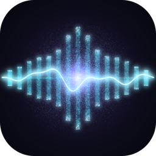
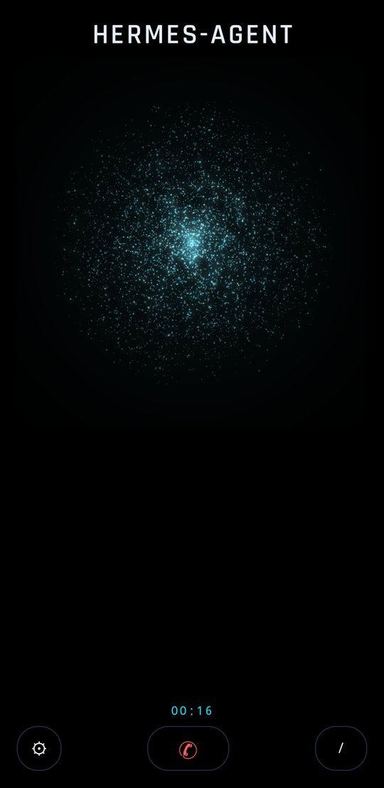
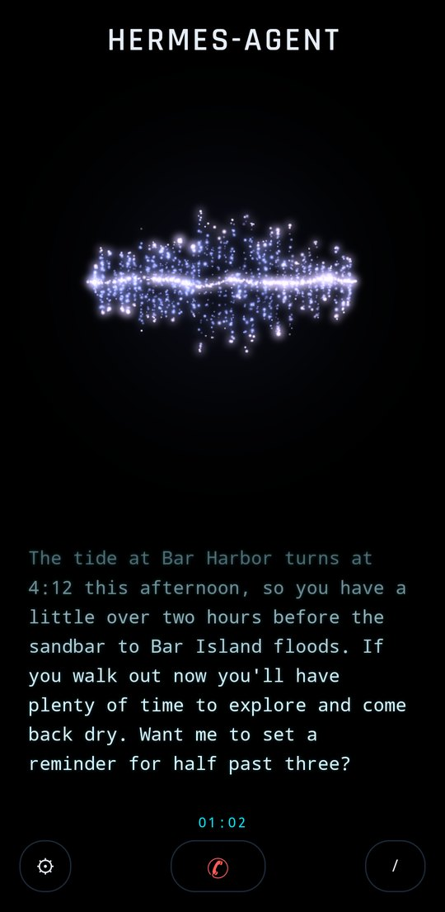
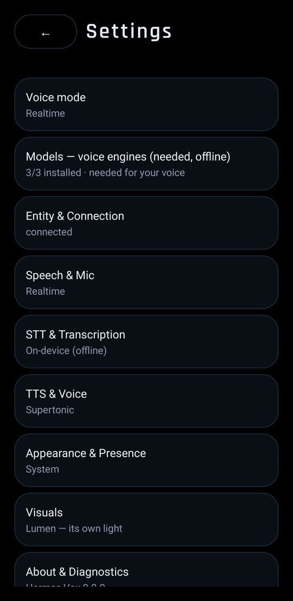
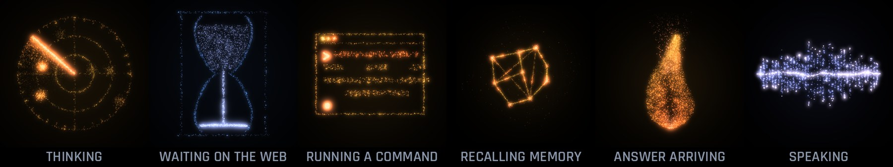
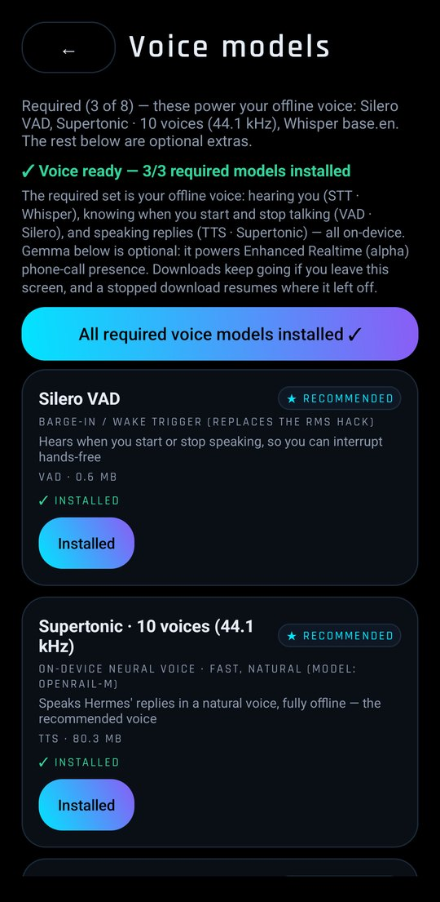
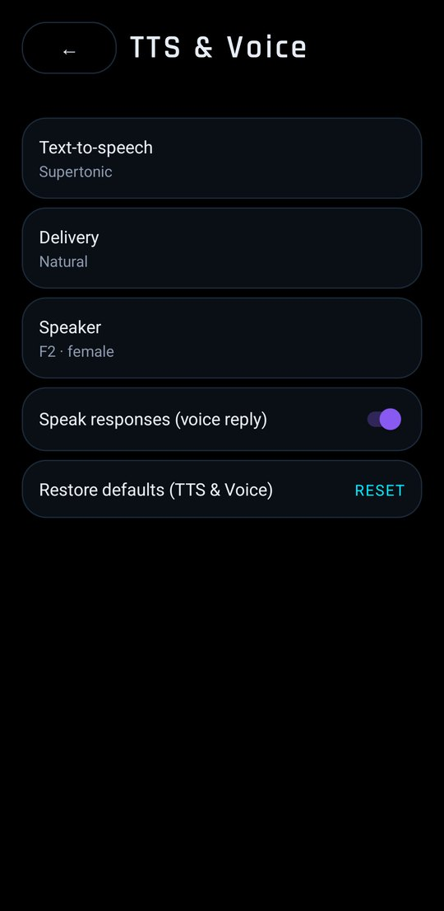
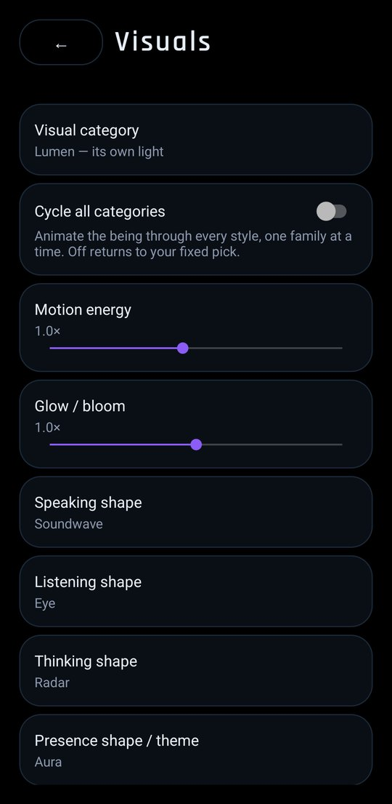

<p align="center">
  
</p>

<h1 align="center">Hermes Vox</h1>

<p align="center">
  <b>The voice of your Hermes agent — on your phone.</b><br>
  An open-source Android voice client with on-device speech and a living, GPU-drawn presence.<br>
  You talk to the same agent you already use everywhere else.
</p>

<p align="center">
  <a href="https://apps.obtainium.imranr.dev/redirect?r=obtainium://add/https://github.com/chezgoulet/hermes-vox"></a>
</p>

<p align="center">
  <a href="https://hermesvox.org">hermesvox.org</a> ·
  <a href="https://github.com/chezgoulet/hermes-vox/releases/latest">Latest release</a> ·
  <a href="docs/ARCHITECTURE.md">Architecture</a> ·
  <a href="ROADMAP.md">Roadmap</a> ·
  <a href="CONTRIBUTING.md">Contributing</a>
</p>

> **Beta — early days, moving fast.** Hermes Vox is installable and works, but it is
> a work in progress: expect rough edges and things that shift between releases. Help
> is very welcome, especially **testing on real phones, polish, and bug reports**.

> **Bring your own gateway.** Vox is a **client**, not a service. There is no hosted
> cloud and nothing to sign up for: you point the app at **your own
> [Hermes Agent](https://hermes-agent.nousresearch.com)** gateway — the endpoint and
> API key of an instance *you* run, locally, on your network, or on a box you own.

---

## See it

<table>
  <tr>
    <td align="center"></td>
    <td align="center"></td>
    <td align="center"></td>
  </tr>
  <tr>
    <td align="center"><sub>An open call — hands-free, no push-to-talk</sub></td>
    <td align="center"><sub>Speaking — the words follow the voice</sub></td>
    <td align="center"><sub>Settings — everything local, in plain language</sub></td>
  </tr>
</table>

**The being shows the agent's real work.** Every tool call Hermes makes reaches the
phone, and the being takes a shape for it:



**27 shapes**, drawn on the GPU from 6,000 points of light. Pick one for rest, listening,
thinking and speaking, or let it cycle:


<table>
  <tr>
    <td align="center"></td>
    <td align="center"></td>
    <td align="center"></td>
  </tr>
  <tr>
    <td align="center"><sub>Models download in-app, resumable, sha256-verified</sub></td>
    <td align="center"><sub>Supertonic: ten on-device voices</sub></td>
    <td align="center"><sub>Visuals: a shape for every state</sub></td>
  </tr>
</table>

<sub>Screenshots are from the 0.8.0 build on an Android 15 emulator.</sub>

---

## Why it exists

The best voice AI feels **present**: it answers straight away, lets you interrupt,
and sounds like someone. Most of it is also a voice with no agent behind it, or an
agent that lives in somebody else's cloud.

[Hermes Agent](https://hermes-agent.nousresearch.com) by
[Nous Research](https://nousresearch.com) is a real agent you run yourself, with
tools, long-term memory, skills and a persistent identity. Hermes Vox gives it a voice
and a face without adding a second brain:

- **The entity IS Hermes.** It is not a persona layered on top. Hermes owns the reasoning,
  tools, memory and context. The phone owns what has to be instant: hearing,
  turn-taking, interruption, the voice and the presence.
- **Sovereign by construction.** Speech recognition and synthesis run on the phone. The
  only network peer is the gateway you configure. No accounts, no vendor cloud, no
  keys in the app.
- **One agent, many doors.** Vox is one more frontend to the same Hermes instance that
  already serves you on Telegram, desktop or the CLI. It never forks the agent.
- **Open.** Apache-2.0, reproducible build, secret-free CI.

## What it does

- **Hands-free calls.** An open line, voice-activity gated, with barge-in: talk over a
  reply and it stops and listens. Your interrupting words become the next turn.
- **On-device hearing.** Silero VAD plus Whisper (int8) or NVIDIA Parakeet-TDT, via
  sherpa-onnx. Hermes always receives the **whole** utterance, validated against
  Whisper's known hallucinations, and a dim "heard" line shows what was sent.
- **On-device voice.** [Supertonic](https://huggingface.co/Supertone/supertonic-2), with
  ten voices at 44.1 kHz, about ten times faster than real time. It was chosen by a
  [measured bake-off](docs/VOICE-BAKEOFF.md). Piper is the lighter option and the
  system voice the fallback.
- **The being.** A GPU-rendered presence that breathes at rest, sweeps like radar while
  thinking, types itself out while running a command, links a constellation while
  recalling, rises as a flame while the answer streams, and becomes a soundwave as it
  speaks.
- **The reply, as words.** The answer scrolls under the being, locked to what has actually
  been spoken.
- **Enhanced Realtime (alpha).** An on-device Gemma 4 E2B "soul" (LiteRT-LM, on the GPU)
  takes the opening beat of every turn in the agent's own voice. It hears your tone and
  hands over to Hermes for anything real.
- **Downloads that finish.** Models download in the background with pause and resume
  (HTTP range requests), survive network loss, and are sha256-checked before install.
- **Stays lit.** The screen stays on while a call is open (switchable), and the power
  button still works.
- **More than one person, one gateway.** An optional per-device entity scope gives each
  person their own memory on a shared gateway.

## Voice modes

Settings → **Voice mode**:

1. **Realtime.** On-device STT, VAD and TTS with Hermes behind them, on a hands-free
   line with barge-in. It feels like a live call.
2. **Enhanced Realtime (alpha).** Realtime **plus** the on-device Gemma 4 E2B presence
   layer: the soul greets you, speaks the first beat of each turn while Hermes thinks,
   and answers small talk itself. Hermes can then stay silent (`<<SKIP>>`) instead of
   answering twice. It needs the 2.6 GB presence model and a phone GPU.

**The entity is Hermes in both modes.** Only the foreground voice changes.

## The contract: Hermes decides, the soul expresses

The on-device model is an **expression layer**, never a second brain:

- **Gemma speaks; Hermes acts.** The soul produces conversation: greetings, beats,
  acknowledgements. It never calls tools or reasons in Hermes' place. It says "let me
  look that up"; Hermes is the one that looks it up.
- **No tools at the edge.** The on-device runtime has no tool interface.
- **One soul.** The soul borrows Hermes' identity through an agent-authored `VOX.md`
  distilled from its `SOUL.md`. The phone mirrors it read-only and never writes identity
  back.
- **Hermes trumps the soul.** Any real answer, tool result or report preempts the voice.
  Barge-in interrupts both.

The whole system on one page — the layers, the Hermes API contract, how each piece maps
to Sesame's components of voice presence, and the honest gaps — is in
[docs/ARCHITECTURE.md](docs/ARCHITECTURE.md).

## Install

**Obtainium (recommended).** [Add Hermes Vox to Obtainium](https://apps.obtainium.imranr.dev/redirect?r=obtainium://add/https://github.com/chezgoulet/hermes-vox),
or add `https://github.com/chezgoulet/hermes-vox` as a GitHub source. Obtainium installs
the signed APK from each GitHub release and keeps it updated.

**APK.** Download `hermes-vox-<version>.apk` from
[Releases](https://github.com/chezgoulet/hermes-vox/releases/latest) and install it
(allow installs from that source). Nightly pre-releases are published from `testing`.

**Google Play — coming soon.** A Play Store listing is planned but not yet live. It
will stay a bring-your-own-gateway client.

### First run

1. Enter your gateway **endpoint** (for example `https://<machine>.<tailnet>.ts.net`)
   **and** its `API_SERVER_KEY`. Both are required; the gateway answers an
   unauthenticated request with `401`.
2. Download the three required models in **Settings → Models**: Silero VAD, Supertonic
   and Whisper base.en (about 290 MB in total). Parakeet (482 MB) and Gemma 4 E2B
   (2.6 GB, for Enhanced Realtime) are optional.
3. Tap the call button and talk.

Notes on the fields:

- **The endpoint may carry a trailing slash.** Vox trims it. (The gateway itself
  answers `404` for `//v1/...`.)
- **A Hermes profile name is not a key.** It is the *model* value: on a non-default
  profile, put the profile's name in **Model** instead of `hermes-agent`. Vox does not
  yet speak the gateway's `/p/<profile>/` URL-prefix routing.

### Build from source

```bash
# Go 1.26, JDK 17, Android SDK + NDK 25.2 (JAVA_HOME / ANDROID_HOME /
# ANDROID_NDK_HOME exported). One command fetches the verified sherpa-onnx
# runtime, binds the Go connector (mobile.aar), builds the APK and runs every
# test — see CONTRIBUTING.md:
bash scripts/gate.sh
# -> android/app/build/outputs/apk/debug/hermes-vox-<version>.apk
adb install -r android/app/build/outputs/apk/debug/hermes-vox-*.apk
```

## The stack

- **Android.** Native Kotlin, AppCompat, no Material. It carries the UI and the voice
  pipeline.
- **Speech.** [sherpa-onnx](https://github.com/k2-fsa/sherpa-onnx) runs Silero VAD,
  Whisper or Parakeet STT, and Supertonic or Piper TTS, all on the CPU with tuned
  thread counts.
- **The entity.** The Hermes gateway (`/v1/responses` streaming, `/v1/runs`), reached
  over your private network. Hermes does all the reasoning, tools and memory.
- **The connector.** Go, bound with gomobile (`voice/`, `mobile/`): the SSE stream, tool
  events, and stream cancellation for barge-in.
- **The soul.** Gemma 4 E2B on LiteRT-LM, GPU-first with a CPU fallback (Enhanced
  Realtime only).
- **The being.** OpenGL ES 3 on its own thread: 6,000 stateless particles placed by
  the vertex shader, with two-level bloom and a filmic tone curve. It runs at 60 fps,
  pauses in the background, and degrades gracefully on weaker GPUs.
- **The icon.** Rendered from the being's own shaders by `tools/icon/render_icon.py`.

## Security

- **Vox never ships with a key; you enter your own.** The gateway API key is entered
  during onboarding or in Settings → Entity. There is no baked-in, env-injected or
  default key, and a release-build guard fails the build if one is ever added.
- The key is encrypted at rest (Android Keystore, AES/GCM). App backups are disabled.
- Model downloads are streamed, resumable, sha256-verified and unpacked with a zip-slip
  guard into app-private storage.
- **TLS everywhere**, except tailnet MagicDNS names (`*.ts.net`), which the tailnet
  already encrypts. There are no per-host cleartext exceptions.

See [SECURITY.md](SECURITY.md) for the threat model and how to report a vulnerability.

## More than one person, one gateway

Every Vox install authenticates with the gateway's `API_SERVER_KEY`, which names the
*deployment*, not the caller. So two people behind one gateway look identical to the
entity unless the client says who it is.

Vox says it with the API server's own identity header, **`X-Hermes-Session-Key`**
(**Settings → Entity → Entity scope**, optional):

- It is a **stable per-channel identifier**, such as `agent:vox:phone:alex`.
- Hermes derives the **long-term-memory scope** from it, so each person gets their own
  memory while still talking to the *same* agent.
- **Blank means not declared.** A single-user setup needs nothing here.
- It is not a credential, so it is stored unencrypted in app prefs. Vox validates it
  (up to 256 characters, no CR/LF/NUL) before sending.

Give two devices the same scope only when you *want* them to share one memory.

## Privacy

- **A private network you control is assumed** — a VPN or tunnel such as Tailscale or
  Nebula. Vox suggests one but never requires a specific product.
- **Your audio never leaves the phone** except as text to your own gateway. Speech
  recognition, synthesis and the Enhanced Realtime tone listening all run on-device.
  The only other network destinations are the model downloads you start.
- Logs are local-only, and transcript logging is off by default.

The full policy, with a source file for every claim, is in [PRIVACY.md](PRIVACY.md).

## Status

**0.8.0 — "the accelerator release"** is the current release
([notes](docs/RELEASE-0.8.0.md)). What is in progress, honestly:

- **Real-phone verification** of the newest pieces: the soul's beat latency on a phone
  GPU, Parakeet's on-phone speed, echo handling after a reply.
- **0.9 — voice and the arrangement:** streaming speech recognition (to unlock semantic
  turn-taking and backchannels), a presence-sized soul model, and more voice choice.
- **Google Play:** coming soon.
- **Longer horizon:** full-duplex conversation, and a desktop client on the same Go core.

The details are in [ROADMAP.md](ROADMAP.md).

## Troubleshooting

### "Cleartext HTTP traffic not permitted"
Vox only speaks HTTPS to your gateway (plain HTTP would expose your API key and
transcripts). The one exception is a tailnet MagicDNS name. Put the gateway behind
HTTPS on your tailnet:

1. On the gateway host: `tailscale serve --bg --https=443 http://127.0.0.1:<port>`
2. In Vox, use the HTTPS MagicDNS endpoint: `https://<machine>.<tailnet>.ts.net`
3. If your tailnet CA isn't publicly trusted, install it on the phone
   (Settings → Security → Trust device certificates). The app trusts user CAs.

### It connects, but every call fails
Check the endpoint for a **doubled path or a path prefix**. The Hermes API server
answers `404` for `/v1/models/` and `//v1/models`. If you are behind a reverse proxy or
a `/p/<profile>` prefix, make sure the forwarded path matches exactly (`/v1/responses`,
not `/hermes/v1/responses`).

### "Preparing your voice…" stays up
The required models are not all installed yet. Open **Settings → Models**; downloads
continue in the background and resume after network loss.

## Credits

Hermes Vox exists because of **[Hermes Agent](https://hermes-agent.nousresearch.com)**
([GitHub](https://github.com/NousResearch/hermes-agent)) and the team at
**[Nous Research](https://nousresearch.com)**, who build and open-source the agent that
is the mind behind every word Vox speaks. Thank you.

Also standing on: [sherpa-onnx](https://github.com/k2-fsa/sherpa-onnx) (k2-fsa),
[Supertonic](https://huggingface.co/Supertone/supertonic-2) (Supertone), Whisper
(OpenAI), Parakeet-TDT (NVIDIA), Silero VAD, Piper, Gemma and LiteRT-LM (Google), and
the Rajdhani typeface (Indian Type Foundry, OFL). Model licenses are listed in
[NOTICE](NOTICE).

Hermes Vox is an independent community project. It is not affiliated with or endorsed by
Nous Research.

## License

[Apache-2.0](LICENSE).
